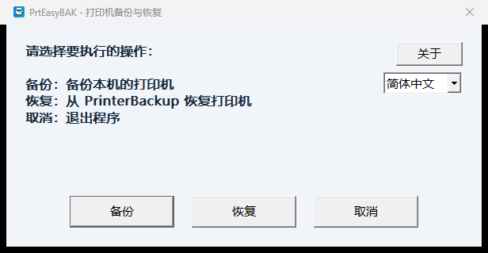
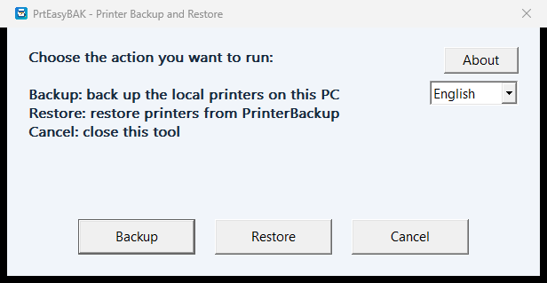
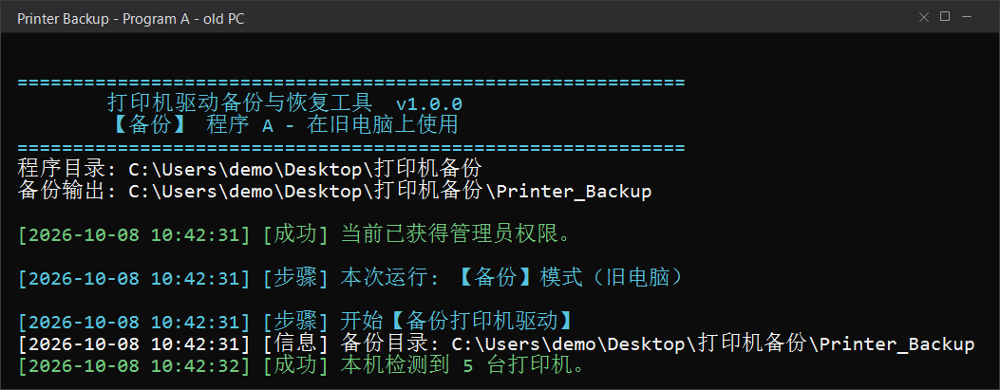
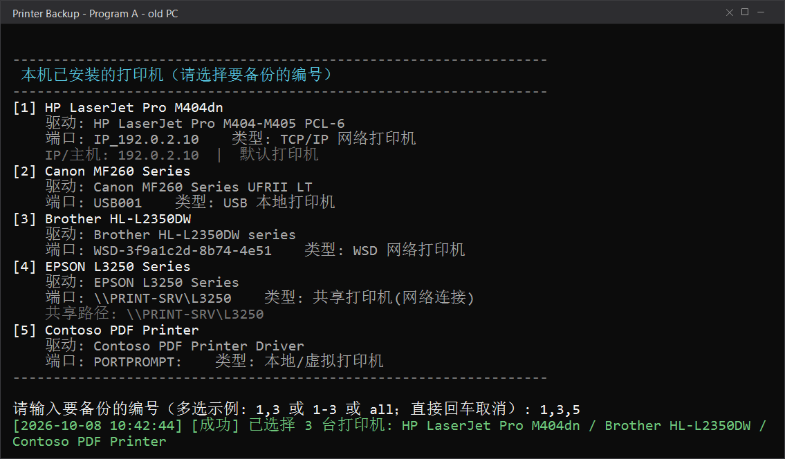
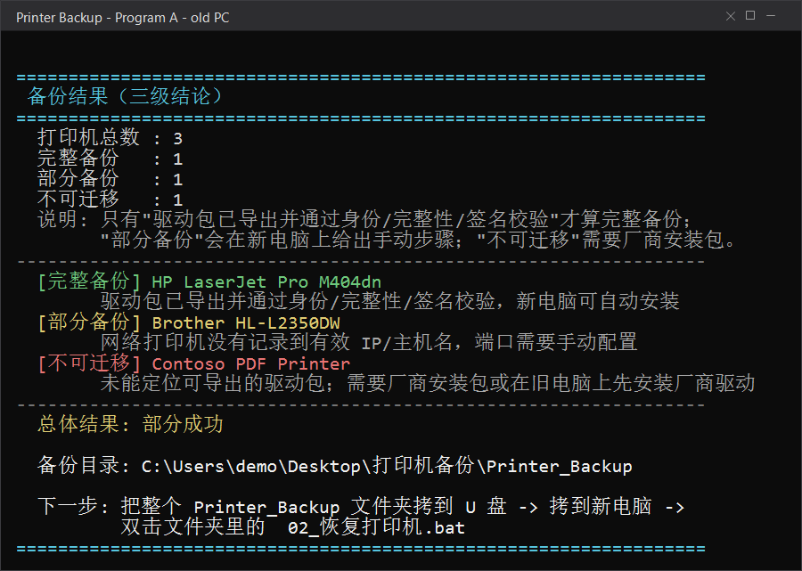
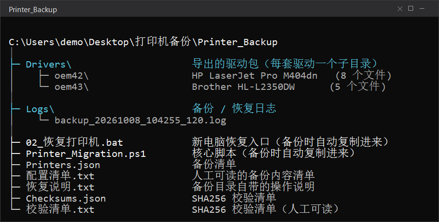
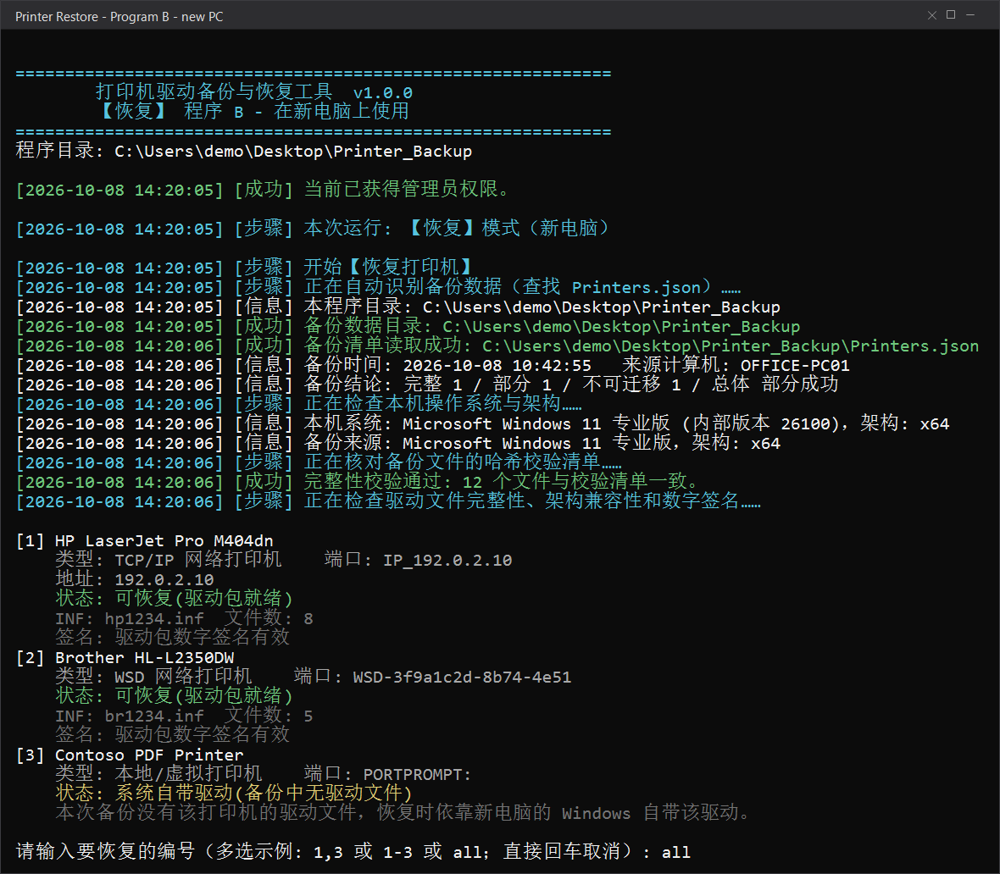
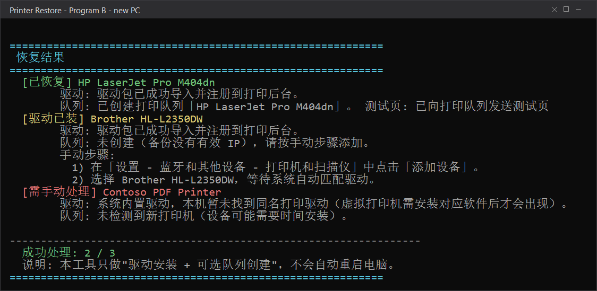
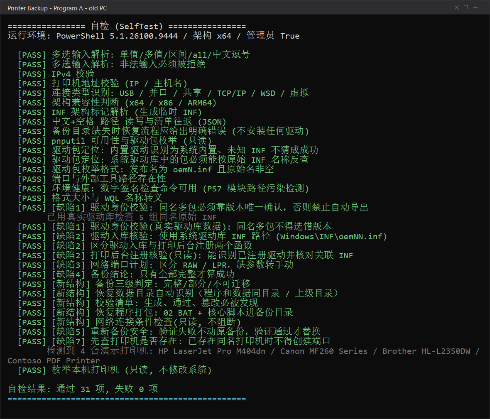

[中文](README.md) | English

# 🖨️ Windows Printer Migration Tool

> Move your printers, drivers and settings from an old PC to a new one.
> **Two versions — pick either one, both are maintained.**

`v1.1.0` ｜ Windows 10 / 11 ｜ GUI: single portable EXE ｜ CLI: zero dependencies

### 📦 [Download v1.1.0](https://github.com/IcemanKH/windows-printer-migration/releases/latest)

> Both versions follow the same three steps: **back up on the old PC → carry it over on a USB drive → restore on the new PC**.

---

## 🧭 Pick a version first

| | **🅰️ GUI version** (recommended for most users) | **🅱️ Batch version** (recommended for technical users) |
| --- | --- | --- |
| Download | [`PrtEasyBAK-zhCN-v1.1.0.zip`](https://github.com/IcemanKH/windows-printer-migration/releases/download/v1.1.0/PrtEasyBAK-zhCN-v1.1.0.zip) | [`Printer-Migration-CLI-v1.1.0.zip`](https://github.com/IcemanKH/windows-printer-migration/releases/download/v1.1.0/Printer-Migration-CLI-v1.1.0.zip) |
| Shape | One standalone EXE, double-click to run | Two BAT files + one PowerShell script |
| Interface | Graphical window, **Simplified Chinese by default**, switchable to **English / Traditional Chinese** | Interactive Chinese console |
| Dependencies | None (portable single file, static CRT) | None (Windows built-in components only) |
| Best for | Users who want to click through the whole backup and restore | Technical users who want to see every step, work offline, or script it |
| Origin & license | Derived from an upstream open-source project, **MIT** (author Terence0816 — see [`gui/LICENSE`](gui/LICENSE)) | Original scripts of this repository, **no licence specified yet** |

> Both versions do the same job — **use whichever you prefer**.

---

## 🅰️ GUI version (recommended for most users)

**Download**: [`PrtEasyBAK-zhCN-v1.1.0.zip`](https://github.com/IcemanKH/windows-printer-migration/releases/download/v1.1.0/PrtEasyBAK-zhCN-v1.1.0.zip) ｜ Details: [`gui/README.md`](gui/README.md)

- Single EXE — unzip and double-click, nothing to install
- **Simplified Chinese by default**; switch to **English** or **Traditional Chinese** at any time — the choice is applied immediately and remembered
- Tick the printers you want with the mouse; no commands to memorise
- Backed up: printer name, driver / model, port, printer preferences, default printer information
- Restore: installs the backed-up driver, recreates the port and print queue, imports printer preferences and tries to restore the default printer
- Common virtual printers are skipped automatically

### How to use

1. **Old PC**: unzip → double-click `PrtEasyBAK.exe` → accept the UAC prompt → choose **Backup** → tick the printers → start; a `PrinterBackup\` folder is created next to the EXE;
2. **Carry it over**: copy the whole `PrinterBackup` folder to a USB stick or external drive, then to a local disk on the new PC;
3. **New PC**: place `PrinterBackup` next to `PrtEasyBAK.exe` → run it → choose **Restore** → tick the printers → confirm and let it restore.

### Screenshots

Simplified Chinese (default):



English (switchable from the drop-down in the top-right corner at any time):



> These are **real screenshots of the program**. They contain only the program's own interface — no real printer names, IP addresses or user names.

### Origin and licence

The GUI version is derived from **Terence0816**'s open-source project <https://github.com/Terence0816/Windows-Printer-Backup-Restore>. It is **not original work by this repository**:

- The upstream project is released under the **MIT License**; the original copyright notice and the full licence text are kept in [`gui/LICENSE`](gui/LICENSE);
- The upstream program name, version `v1.2.0.0`, icon and attribution are all preserved;
- The main change in this release is **a new Simplified Chinese localization with Simplified Chinese as the default language, plus language-switching support** — no functionality beyond backup/restore was added;
- Building from source and the language tests are documented in [`gui/README.md`](gui/README.md).

---

## 🅱️ Batch version (recommended for technical users)

> Two BAT files and one PowerShell script to move your printers and their drivers from an old PC to a new one.
> **Tiny, simple, nothing to install.**

**Download**: [`Printer-Migration-CLI-v1.1.0.zip`](https://github.com/IcemanKH/windows-printer-migration/releases/download/v1.1.0/Printer-Migration-CLI-v1.1.0.zip)

> Unzip it and **keep all three scripts in the same folder** — then double-click `01_备份打印机.bat` to start.

## ✨ Why use it

- **Tiny** — just 3 files, copy them anywhere and run
- **Zero dependencies** — Windows built-in components only, no third-party software
- **Simple** — double-click a BAT, pick your printers, back them up; copy to the new PC, double-click, restore
- **Self-contained restore** — the backup folder automatically carries its own restore launcher and core script
- **Strict validation** — driver identity + SHA256 + digital signature; anything that fails is not installed
- **Deliberately cautious** — no `Bypass`, no `/force`, no system policy changes, never overwrites existing printers
- **Clear verdicts** — every printer is labelled *Complete backup* / *Partial backup* / *Not migratable*

---

## 🎯 Who it's for

- Setting up a new starter's PC with the printers they need
- Restoring printers after a clean Windows reinstall
- Moving printers when you switch to a new computer
- Restoring from a USB drive when the new PC has no usable network

---

## 📁 Files

Put these **3 files in the same folder**:

| File | Purpose |
| --- | --- |
| `01_备份打印机.bat` | Run on the **old** PC |
| `02_恢复打印机.bat` | Run on the **new** PC |
| `Printer_Migration.ps1` | Core script, invoked by both BAT files |

> ⚠️ All three files must sit in the same folder. Each BAT checks that the core script is next to it and exits with an error if it is missing.

When the backup entry is launched, it first prints the banner, the program folder and the backup output folder:



> **About the screenshots** — the six backup/restore flow images (`backup-entry`, `backup-select`, `backup-result`, `backup-folder`, `restore-entry`, `restore-result`) are **simulated interfaces drawn from the program's real output format**, using demo data (sample printer names, a sample computer name and RFC5737 documentation IPs). They are **not screenshots of a real run**.
> `selftest.png` is a **redacted version of genuine self-test output**. No real printer migration has been validated in this repository: these images illustrate the UI and the workflow only, and do not mean that any real printer or driver was migrated successfully.
> (The three `gui-*.png` images are **real screenshots of the GUI version**, containing only the program interface.)

---

## 🚀 Three steps

### 1️⃣ Old PC: back up

Double-click `01_备份打印机.bat` → accept the UAC prompt → choose which printers to back up:

```text
2          # one printer
1,3,5      # several (comma- or space-separated)
1-3        # a range
all        # everything
```



When it finishes, a `Printer_Backup/` folder is created next to the script:

```text
Printer_Backup/
├── 02_恢复打印机.bat      ← copied in automatically; the restore entry for the new PC
├── Printer_Migration.ps1  ← copied in automatically; the core script
├── Printers.json          ← backup manifest
├── 配置清单.txt            ← human-readable summary
├── 恢复说明.txt            ← restore instructions shipped with the folder
├── Checksums.json         ← SHA256 checksum manifest
├── 校验清单.txt            ← SHA256 checksum manifest (human-readable)
├── Drivers/               ← exported driver packages
└── Logs/
```

Each printer gets a three-level verdict, summarised at the end:



### 2️⃣ Move it across

Copy the **whole** `Printer_Backup` folder to a USB stick or external drive, then copy it to a local disk on the new PC (for example, the Desktop).

> Copy the entire folder, not a handful of files — and don't run the restore directly from the USB drive or a network share.



### 3️⃣ New PC: restore

Double-click `Printer_Backup\02_恢复打印机.bat` → accept the UAC prompt → follow the prompts:

- **Driver package available** → installs the driver and recreates the port and print queue
- **Network printer with an IP** → shows the port plan, then creates it and checks connectivity once you confirm
- **USB printer** → asks you to plug it in and power it on, then detects it
- **Not enough information** → prints the manual steps instead

Before touching anything, it locates the backup automatically, verifies the SHA256 checksums and checks architecture compatibility and signatures:



Afterwards you can optionally print a test page and review the summary: **Restored / Driver installed / Needs manual steps**.



---

## 🔍 Differences between the two versions

| | 🅰️ GUI version | 🅱️ Batch version |
| --- | --- | --- |
| Interaction | Graphical window, tick with the mouse | Type numbers in the console |
| UI language | Simplified Chinese (default) / English / Traditional Chinese | Chinese console only |
| Driver integrity checks | Built into the program's flow | Driver identity + SHA256 + digital signature; failures are not installed |
| Backup folder name | `PrinterBackup` | `Printer_Backup` |
| Shared printers | Three restore modes: original connection / Local Port / LPR Port | Never connected automatically — add them manually |
| Self-test command | none | `01_备份打印机.bat -SelfTest` |
| Output detail | Graphical progress and a result summary | Line-by-line console output, easier to troubleshoot |
| Technology | Native C++ (derived from the upstream open-source project) | BAT + Windows PowerShell 5.1 |
| Licence | MIT (upstream, author Terence0816) | Not specified |

> **The two backup formats are not interchangeable**: the GUI reads `PrinterBackup`, the batch version reads `Printer_Backup`. Restore with the same version you backed up with.

---

## 🧩 Backup verdicts (batch version)

| Verdict | Meaning |
| --- | --- |
| ✅ **Complete backup** | The driver was exported and passed identity, integrity and signature checks — it can be installed automatically |
| ⚠️ **Partial backup** | A driver file is missing, or one manual step is needed (shared printers, network printers with no IP, USB printers that need replugging) |
| ❌ **Not migratable** | The old driver has no exportable INF — install the vendor's driver package on the new PC |

> The overall result is **Success** only when every selected printer is a complete backup.

---

## 🛠️ Requirements

- Windows 10 / 11 (GUI: x64; batch: x86 / x64 / ARM64)
- The batch version needs Windows PowerShell 5.1 (ships with Windows); the GUI version does not
- Both need administrator rights and request UAC elevation automatically
- Everything they use ships with Windows: `pnputil`, the `PrintManagement` module, `printui.dll` and so on; the GUI is a statically linked single file with no extra runtime

---

## 🔐 Permissions and execution policy

(Applies to the batch version)

- Backup and restore both need administrator rights; if the UAC prompt is dismissed, right-click the BAT and choose **Run as administrator**
- It **never** uses `-ExecutionPolicy Bypass` and **never** changes system policy
- Only when the policy is the Windows default does it add `RemoteSigned` for the current process; Group Policy always wins
- If the script is "blocked": right-click `Printer_Migration.ps1` → Properties → tick **Unblock**

---

## ❓ Troubleshooting

| Symptom | What to do |
| --- | --- |
| `Printer_Migration.ps1 was not found` | The three files aren't in the same folder |
| `running scripts is disabled` | Execution policy is blocking it — see the section above, or ask IT to allow it |
| `Printers.json was not found` | The backup folder wasn't copied in full |
| Checksum mismatch | The backup is corrupt and the installer refuses to continue — back up again from the old PC |
| Network printer not responding | It's powered off or on a different network; you can create the queue first and confirm later |
| Shared printer not restored | Shared printers need network and account access, so they are never connected automatically — add them by hand |
| "Not migratable" reported | Install the vendor's driver package on the new PC |
| USB printer not detected | Plug it in and power it on, wait for a port such as `USB001`, then run the restore again |
| Test page didn't print | The tool can only queue the job — check the printer's power, paper and queue |
| Default printer changed | The tool tries to restore it and warns you if Windows overrode it; you can set it manually |
| GUI can't find a backup | Make sure the `PrinterBackup` folder sits next to `PrtEasyBAK.exe` |
| GUI interface isn't in Chinese | Pick 简体中文 from the drop-down in the top-right corner — the choice is remembered |
| GUI asks for administrator rights | Right-click `PrtEasyBAK.exe` → **Run as administrator** |

---

## ⚠️ Known limitations

(Batch version)

1. Only drivers that can be exported as an INF from the Windows driver store can be restored automatically
2. Vendor installers are not exported; drivers without an INF are marked as not migratable
3. Cross-architecture restore is not supported (32↔64 and x64↔ARM64 drivers usually can't be installed)
4. Shared printers are never connected automatically
5. Network printers need a valid IP; WSD ports have to be rediscovered on the new PC
6. Existing printers with the same name are never overwritten
7. Nothing is deleted, the default printer is not changed, and the PC is never rebooted
8. `/force` is never used — a failed signature check means the driver is not installed
9. Only the printers you select are processed; the driver store is never exported wholesale

(GUI version)

1. **No real printer migration has been validated**: driver installation, port recreation and printer-preference import were not exercised on a real machine
2. Not every printer model or driver version is covered — **full driver compatibility is not promised**
3. Some printer preferences may still depend on the driver version and the Windows version
4. USB printers may still need replugging or manual port confirmation after restore
5. Network shared printers require the original print server to remain reachable

---

## 🧪 Self-test (batch version)

```bat
01_备份打印机.bat -SelfTest
02_恢复打印机.bat -SelfTest
```

- Read-only: installs no drivers, changes no configuration, sends no test page
- Prints `[PASS]` / `[FAIL]` per case, and exits with code 1 if anything fails



> This image is a **redacted version of genuine self-test output** — only the line containing real printer names was replaced. It is not a simulated interface.

---

## 🔏 Security notes

`Printer_Backup/` and `PrinterBackup/` contain printer names, IP addresses, ports, share paths, the **computer name and user name** of the old PC, the exported driver packages and the logs.

**Treat it as internal material. Do not upload or share it publicly.**

This repository contains only scripts, the GUI source and documentation; `.gitignore` excludes backup output, driver files and logs. **The release assets contain no real backup data.**

---

## 📄 Licence

This repository as a whole **does not have an open-source licence**. The parts differ:

| Directory / content | Licence status |
| --- | --- |
| Root `01_备份打印机.bat`, `02_恢复打印机.bat`, `Printer_Migration.ps1` | **No open-source licence specified** — please do not redistribute until the author grants permission |
| `gui/` (GUI version, derived from Terence0816's open-source project) | **MIT License** — see [`gui/LICENSE`](gui/LICENSE); the original copyright notice is preserved |

> This release does **not** relicense the whole repository under MIT; MIT applies only to the upstream-derived code inside `gui/`.
