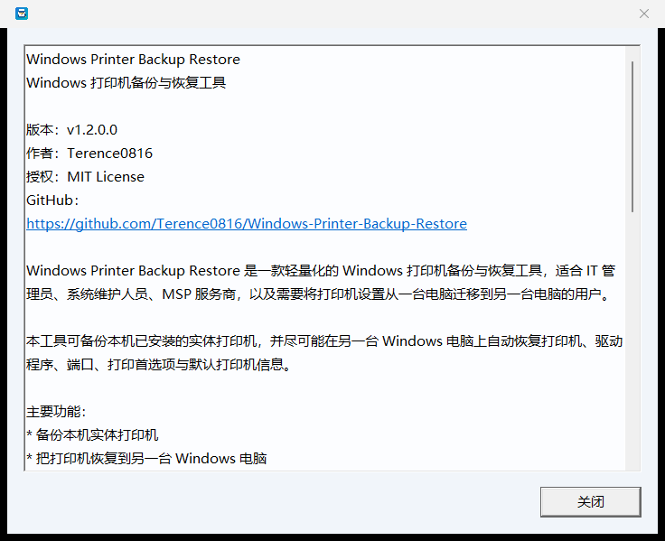

# PrtEasyBAK 简体中文版（图形化打印机备份与恢复）

本仓库从 **v1.1.0** 起提供打印机迁移的**图形化版本**，放在 `gui/` 目录，与根目录原有的 BAT + PowerShell 版本**长期共存**。

- 成品程序：发行版附件 `PrtEasyBAK-zhCN-v1.1.0.zip`
- 程序内部版本：`v1.2.0.0`（上游版本号，未改动）
- 本仓库发行版：`v1.1.0`

---

## 一、来源与许可（必读）

本目录**不是**从零自主开发的作品，而是对下列开源项目的改造：

> **原项目**：Windows Printer Backup Restore
> **作者**：Terence0816
> **仓库**：<https://github.com/Terence0816/Windows-Printer-Backup-Restore>
> **许可证**：MIT License（原文见本目录 [LICENSE](LICENSE)）

改造过程中：

- 上游的 **MIT 许可证原文**完整保留在 `gui/LICENSE`；
- 上游的**作者署名与版权声明**保留在源码、程序「关于」对话框与版本资源中；
- 上游的**程序名称、版本号 `v1.2.0.0`、图标资源**均未改写；
- 本目录不含上游之外的新功能，只做本地化与显示适配。

本仓库根目录的另外两个 BAT 与 `Printer_Migration.ps1` **与本目录无关**，其许可证状态保持不变（根目录未指定开源许可证）。**本次发布没有把整个仓库改为 MIT 许可证**，MIT 只适用于本 `gui/` 目录下的上游衍生代码。

---

## 二、本次改造内容

主要修改只有一项：**新增简体中文本地化，并把默认界面语言设为简体中文。**

| 项目 | 说明 |
| --- | --- |
| 默认语言 | 简体中文。首次运行自动生成 `PrtEasyBAK.ini`，内容为 `ui_lang=zh-CN` |
| 语言切换 | 主界面右上角下拉框：**简体中文（默认）/ English / 繁體中文**，切换后文字与字体立即刷新 |
| 选择保存 | 写入同目录 `PrtEasyBAK.ini`，下次启动沿用 |
| 兼容性 | 已有配置里的 `en` / `zh` / `zh-TW` / `zh-Hant` / `zh-HK` / `tw` / `cht` / `traditional` / `auto` 含义全部保持不变 |
| 中文字体 | 简体中文优先 Microsoft YaHei UI → Microsoft YaHei → SimSun → NSimSun；繁体中文仍用 Microsoft JhengHei UI |
| 补齐遗漏 | 原程序有 21 处错误提示直接写死繁体中文（英文界面下也会显示中文），现全部纳入三语切换 |
| 未改动 | 备份/恢复逻辑、驱动与端口处理、备份文件格式、`PrinterBackup` 目录结构、管理员提权流程 |

术语按中国大陆习惯统一为「打印机 / 驱动程序 / 备份 / 恢复 / 端口 / 打印队列 / 打印首选项」；**厂商名称、型号、驱动标识、系统路径、`Local Port`、`LPR Port` 等端口类型不翻译**。

---

## 三、运行方法

1. 从 [Releases](https://github.com/IcemanKH/windows-printer-migration/releases/latest) 下载 `PrtEasyBAK-zhCN-v1.1.0.zip` 并解压；
2. 双击 `PrtEasyBAK.exe`（会请求管理员权限，与上游行为一致）；
3. 首次运行在同目录生成 `PrtEasyBAK.ini`，界面为简体中文；
4. 需要时在右上角下拉框切换语言。

图形化界面的功能：

- **备份**：列出本机实体打印机（常见虚拟打印机自动跳过），勾选后备份名称、驱动 / 型号、端口、打印首选项与默认打印机信息到同目录 `PrinterBackup\`；
- **恢复**：从 `PrinterBackup\` 勾选要恢复的打印机，自动安装备份的驱动、重建端口与打印队列、导入打印首选项并尝试还原默认打印机；
- **关于**：显示版本、作者、许可证与上游项目地址。

典型场景与批处理版本相同：**旧电脑备份 → U 盘 / 移动硬盘搬运 → 新电脑恢复**。把整个 `PrinterBackup` 文件夹拷到新电脑，放在 `PrtEasyBAK.exe` 旁边即可。

---

## 四、界面截图

以下为**真实运行截图**（本机 Windows 11 + 简体中文系统，界面语言分别切到简体中文与 English）：


程序「关于」对话框中保留了上游作者、版本与许可证信息：



> 截图只包含程序自身界面，不含任何真实打印机名称、IP 或用户名。

---

## 五、从源码编译

需要 Visual Studio 2019 / 2022 生成工具（含「使用 C++ 的桌面开发」工作负载）：

```bat
build.bat
```

产物：`build\PrtEasyBAK.exe`（静态链接 CRT，单文件，免安装，无额外运行库依赖）。

关键编译开关：

| 开关 | 作用 |
| --- | --- |
| `/utf-8` | 源码是 UTF-8，确保中文字面量正确编译 |
| `/std:c++17` | `std::filesystem` |
| `/MT` | 静态 CRT，单个可执行文件 |
| `/DNOMINMAX` | 避免 `<windows.h>` 的 `min` / `max` 宏与 `std::max` 冲突 |

语言行为测试与本地化校验：

```bat
tools\run_tests.bat                 :: 1457 项运行时断言（三语言切换、保存、兼容、回退）
node tools\verify_localization.js   :: 115 个界面字符串是否三语齐全
```

`tools/zh-CN.json` 是简体中文译文表，也是本次翻译的唯一来源。

---

## 六、已验证与未验证

**已验证**（本机 Windows 11 + MSVC 14.51.36231 + Windows SDK 10.0.26100.0）：

- 三种语言切换正常，界面文字与字体同步刷新，窗口标题随语言变化；
- 语言选择保存到 `PrtEasyBAK.ini`，重启沿用；18 种历史 / 别名取值行为与改造前一致；
- 简体中文无乱码、无文字截断；可执行文件内的中文以 UTF-16 正确嵌入；
- 打印机发现与虚拟打印机过滤只读回归（列出实体打印机、自动跳过虚拟打印机）；
- 1457 项语言运行时断言全部通过；115 个界面字符串三语齐全，无遗漏。

**未验证**：

- **没有做过真实打印机迁移验收**：未在本机实际执行驱动安装、端口重建或打印首选项导入；
- 未覆盖所有打印机型号与驱动版本；
- USB 打印机恢复后可能仍需重新插拔或手动确认端口；网络共享打印机需要原始打印服务器仍可访问；
- 上游程序本身的功能限制与注意事项，见上游项目 README。

---

## 七、校验信息

| 文件 | 大小 | SHA-256 |
| --- | --- | --- |
| `PrtEasyBAK.exe`（发行包内） | 615,424 字节 | `40f521d3aca2e94904717a93ba955e16870344e3fa0bc795fbe65d0b0d76ba8e` |
| `Printer-Migration-CLI-v1.1.0.zip` | 见 `SHA256SUMS.txt` | 见发行版附件 `SHA256SUMS.txt` |
| `PrtEasyBAK-zhCN-v1.1.0.zip` | 见 `SHA256SUMS.txt` | 见发行版附件 `SHA256SUMS.txt` |

> 重新编译会因 PE 时间戳不同而产生不同的 SHA-256；上表对应本仓库 v1.1.0 发行包中的可执行文件。
